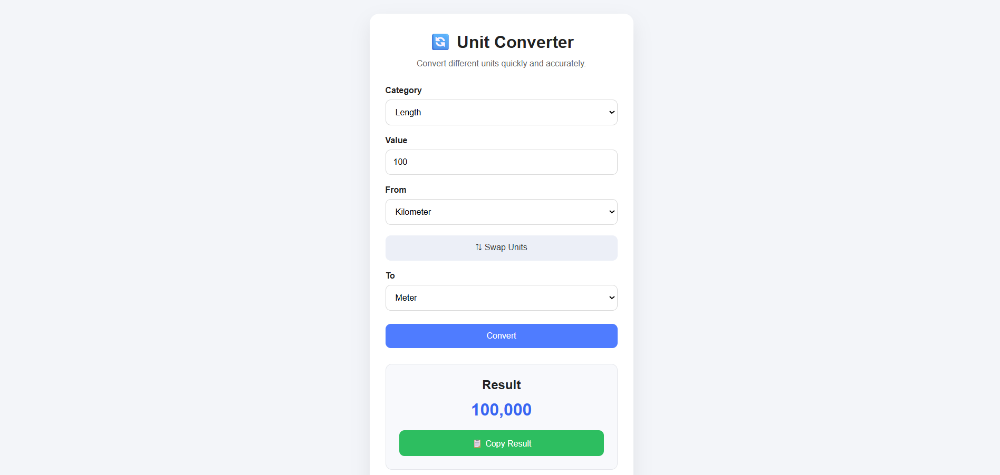

# 🔄 Unit Converter

A clean and responsive Unit Converter built using HTML, CSS, and JavaScript. It supports multiple categories including Length, Weight, Temperature, Volume, Time, and Digital Storage with instant conversion.

---

## ✨ Features

- 📏 Length Conversion
- ⚖️ Weight Conversion
- 🌡️ Temperature Conversion
- 💧 Volume Conversion
- ⏱️ Time Conversion
- 💾 Digital Storage Conversion
- 🔄 Swap Units
- 📋 Copy Result
- ⚡ Instant Conversion
- 📱 Responsive Design

---

## 🛠️ Built With

- HTML5
- CSS3
- JavaScript

---

## 📂 Project Structure

```
unit-converter/
│
├── index.html
├── style.css
├── script.js
└── README.md
```

---

## 🚀 Getting Started

1. Clone the repository

```bash
git clone https://github.com/your-username/unit-converter.git
```

2. Open the project folder.

3. Open `index.html` in your browser.

No installation or dependencies required.

---

## 📸 Screenshots

### Home Page



## 📚 Supported Categories

- 📏 Length
- ⚖️ Weight
- 🌡️ Temperature
- 💧 Volume
- ⏱️ Time
- 💾 Digital Storage

---

## 🌟 Future Improvements

- 💰 Currency Converter
- 🌙 Dark Mode
- 📈 Conversion History
- ⭐ Favorite Units
- 🌍 Multi-language Support
- 📊 Scientific Unit Converter

---

## LIVE AT : https://shirooni-01.github.io/unit-converter/

---

## 👨‍💻 Author

Made with ❤️ by **ASHUTOSH SHIOORKAR**
